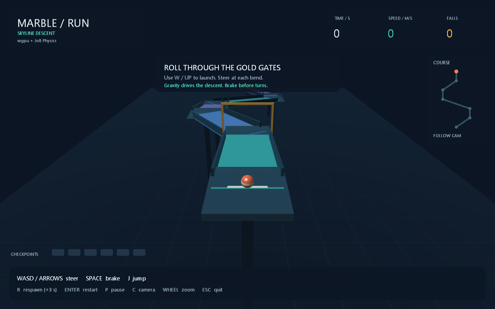

# Marble Run — Skyline Descent

A playable 3D time trial written entirely in Aquarius (`.aqua`). Roll a striped
marble down an elevated, winding course, pass all six gates in order, and beat
your best time. The gold gate is your next checkpoint; completed gates turn
green. Falls respawn you at the last checkpoint and add three seconds.
Finish in 24 seconds for gold or 38 seconds for silver. Best times last for the
current session.

## Gameplay preview



Rendering uses **wgpu through Processing P3D**, with a custom WGSL material,
depth buffering, directional lighting, specular highlights, and distance fog.
Processing supplies GPU canvas presentation and GLFW window/input integration.
**Jolt Physics** simulates the marble and the oriented box track, including
gravity, friction, rolling, rail collisions, and continuous collision detection.
There are no external art assets or changes to the language runtime.

## Run

Use a prebuilt **`AquariusDesktopVMREPL.exe`** distribution with its bundled
graphics and physics dependencies, and a desktop with a compatible GPU driver.
Keep the complete runtime distribution together. From this game's directory,
run the entry script with the executable:

```powershell
# If the executable is on PATH:
AquariusDesktopVMREPL.exe .\main.aqua

# Or specify its full path:
& 'C:\Aquarius\AquariusDesktopVMREPL.exe' .\main.aqua
```

Replace the example path with your executable's location. You can also use the
included launcher, which locates `main.aqua` relative to itself:

```powershell
.\run.ps1                         # Uses AquariusDesktopVMREPL.exe on PATH
.\run.ps1 -VmPath 'C:\Aquarius\AquariusDesktopVMREPL.exe'
```

Script imports resolve relative to each script, so an absolute path to
`main.aqua` also lets you launch from another working directory.

## Controls

| Key | Action |
| --- | --- |
| WASD / arrow keys | Steer in world X/Z: W moves down the course, D moves right |
| Space (hold) | Brake horizontal movement |
| J | Jump when supported by the track |
| R | Return to the last checkpoint, adding 3 seconds |
| Enter | Restart the run; retain the session best |
| P | Pause / resume physics and the timer |
| C | Switch follow / overview camera |
| Mouse wheel | Adjust follow camera distance |
| Esc / close window | Quit |

Press W to start the timer and launch. Gravity supplies most of the downhill
speed; brake before the unrailed bends and steer toward the highlighted gate.
The overview camera and minimap show the whole route. Steering directions remain
world aligned in both camera modes. The camera and HUD respond to window resizing
and display pixel density.

## Scripts

| Script | Responsibility |
| --- | --- |
| `main.aqua` | Composition, sketch lifecycle, clock, and event wiring |
| `config.aqua` | Course nodes, dimensions, physics tuning, and medal targets |
| `math3d.aqua` | Vector math and matching quaternion/matrix transforms |
| `track.aqua` | Shared floor, rail, support, and checkpoint definitions |
| `physics.aqua` | Jolt ownership, fixed updates, controls, respawns, and scoring |
| `input.aqua` | Held-key input and normalized diagonal steering |
| `camera.aqua` | Smoothed follow view, overview, and zoom |
| `shaders.aqua` | WGSL vertex and fragment programs |
| `renderer.aqua` | GPU canvas, track geometry, checkpoints, and rolling marble |
| `hud.aqua` | Timer, progress, minimap, controls, pause, and result panels |

Project-defined variables, function bindings, parameters, and shader variables
use Traditional Chinese names. External runtime APIs and shader entry points
retain the names required by Processing, Jolt, and WebGPU.

Modify `config.aqua` to change the route or movement. Adjacent nodes create
oriented ramps; broad landing pads bridge the corners. Collider and render
geometry share positions, dimensions, and rotations. Arches, checker tiles, and
the scenery grid are decorative. The ground under the elevated track is visual;
falling below the recovery height triggers a respawn.

Physics uses an accumulator at **120 Hz**, with position interpolation for
rendering. Frame deltas are capped at 0.1 seconds / 12 updates to avoid catching
up indefinitely after a long stall. The timer counts simulated time and respawn
penalties. Braking applies drag; jump eligibility uses the oriented floor bounds,
while Jolt owns all contact response. The finish freezes the completed run.
Jolt is disposed on normal exit; the desktop host also releases native resources
if a script or callback fails. Processing releases its window and GPU resources.

## Compile a portable script bottle

Package **every** script, with `main.aqua` first. From this game's directory,
using the same prebuilt executable:

```powershell
$彈珠執行器 = 'C:\Aquarius\AquariusDesktopVMREPL.exe'
$彈珠腳本列表 = @('.\main.aqua') + @(
    Get-ChildItem . -Filter *.aqua |
    Where-Object Name -ne 'main.aqua' |
    Sort-Object Name |
    ForEach-Object FullName
)
& $彈珠執行器 -c --root . -o .\marble_run.bottle @彈珠腳本列表
& $彈珠執行器 .\marble_run.bottle
```

The bottle includes the WGSL strings and needs no art files. Distribute it with
the complete desktop VM and its native dependencies.

## License

This project is licensed under the [MIT License](LICENSE).
